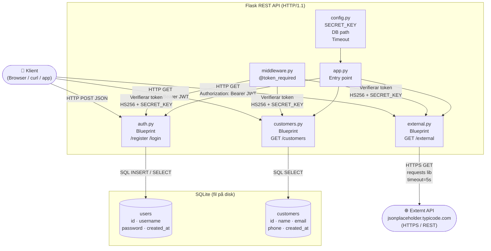
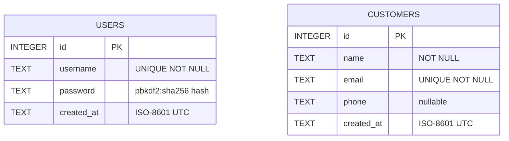
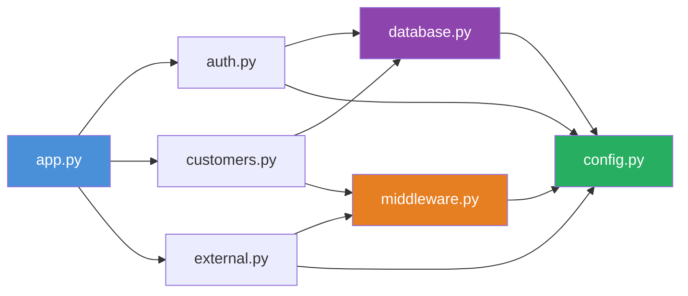
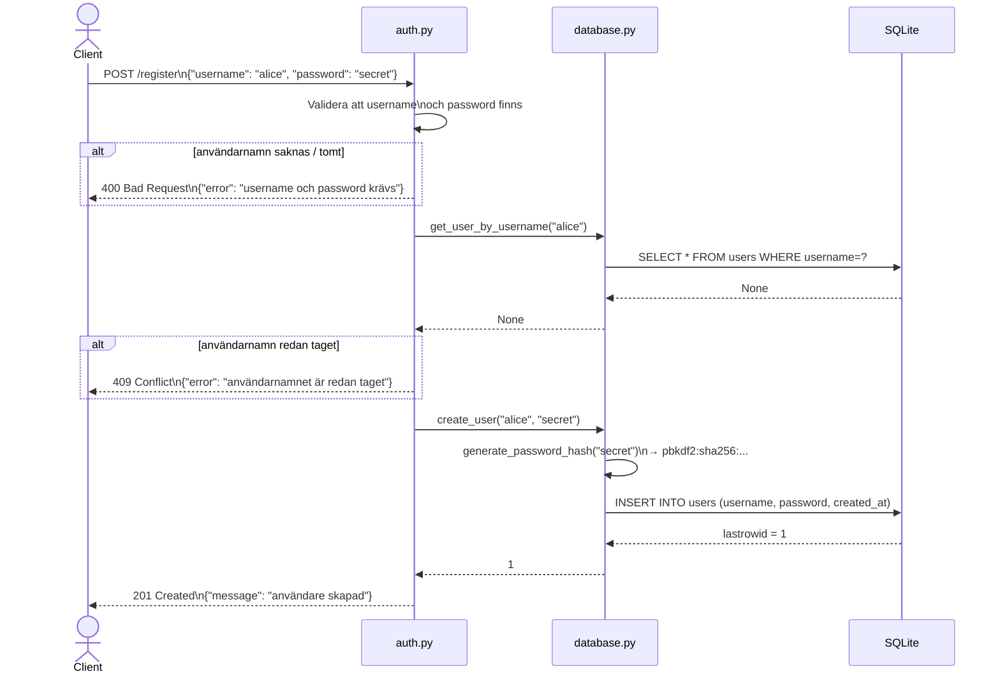
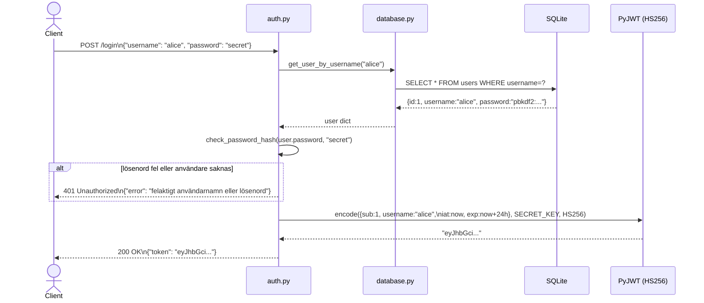
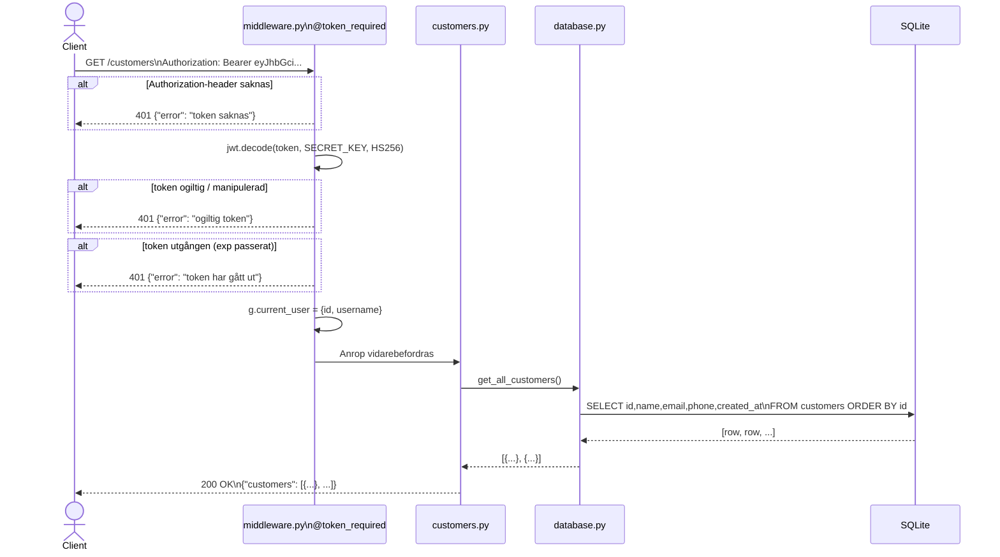
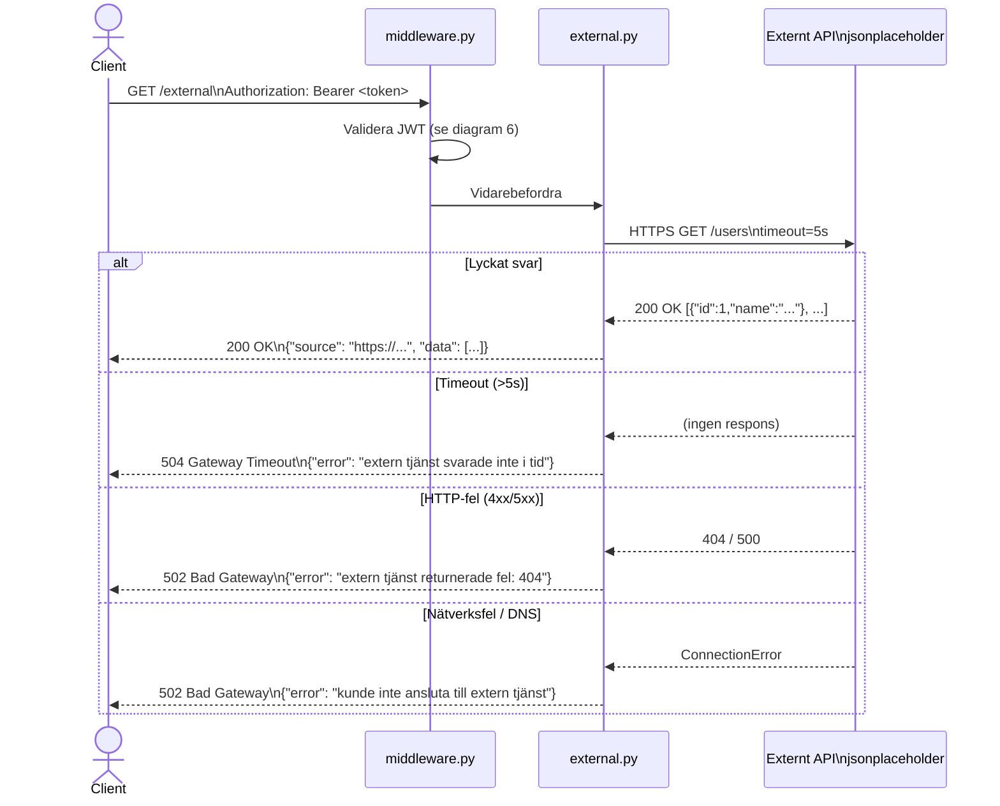
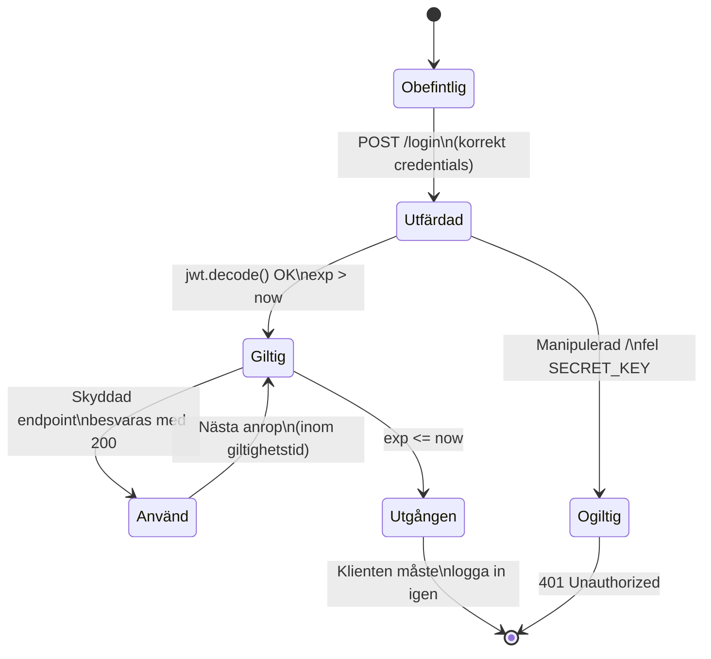

# Customer Management API – Teknisk dokumentation

---

## 1. Systemöversikt

Visar alla komponenter, protokoll och algoritmer på hög nivå.



---

## 2. ER-diagram – Databas



---

## 3. Komponentdiagram (UML)

Visar modulernas beroenden.



---

## 4. Sekvensdiagram – POST /register



---

## 5. Sekvensdiagram – POST /login + JWT-utfärdning



---

## 6. Sekvensdiagram – GET /customers (skyddad endpoint)



---

## 7. Sekvensdiagram – GET /external (proxy + felhantering)



---

## 8. Tillståndsdiagram – JWT-tokens livscykel



---

## 9. Säkerhetsmodell – Sammanfattning

| Lager | Mekanism | Implementation |
|---|---|---|
| Lösenordslagring | PBKDF2-SHA256 + salt | `werkzeug.security.generate_password_hash` |
| Autentisering | JWT Bearer Token | `PyJWT`, algoritm `HS256` |
| Token-integritet | HMAC-signatur | `SECRET_KEY` i `config.py` |
| Token-utgång | `exp`-claim | `JWT_EXPIRATION_HOURS = 24` |
| SQL-injektion | Parametriserade queries | `sqlite3` med `?`-platshållare |
| Timeout-skydd | Request timeout | `EXTERNAL_API_TIMEOUT = 5s` |

---

## 10. Dataflöde – Storyboard

```
┌─────────────────────────────────────────────────────────────┐
│  Scen 1: Ny användare registrerar sig                       │
│                                                             │
│  [Klient] ──POST /register──► [Flask]                      │
│                                   │                         │
│                            Validering OK?                   │
│                            Hash lösenord                    │
│                            Spara i SQLite                   │
│                                   │                         │
│  [Klient] ◄── 201 "användare skapad" ──────────────────    │
└─────────────────────────────────────────────────────────────┘

┌─────────────────────────────────────────────────────────────┐
│  Scen 2: Användaren loggar in och får token                 │
│                                                             │
│  [Klient] ──POST /login──────► [Flask]                     │
│                                   │                         │
│                            Hämta user från DB               │
│                            Verifiera lösenord               │
│                            Generera JWT (24h)               │
│                                   │                         │
│  [Klient] ◄── 200 {"token": "eyJ..."} ─────────────────    │
└─────────────────────────────────────────────────────────────┘

┌─────────────────────────────────────────────────────────────┐
│  Scen 3: Hämta kunder med token                             │
│                                                             │
│  [Klient] ──GET /customers──► [@token_required]             │
│           Authorization:          │                         │
│           Bearer eyJ...       Dekoda JWT                    │
│                               Verifiera signatur            │
│                               Kontrollera exp               │
│                                   │                         │
│                              [customers.py]                 │
│                            SELECT FROM customers            │
│                                   │                         │
│  [Klient] ◄── 200 {"customers": [...]} ────────────────    │
└─────────────────────────────────────────────────────────────┘

┌─────────────────────────────────────────────────────────────┐
│  Scen 4: Proxyanrop till externt API                        │
│                                                             │
│  [Klient] ──GET /external────► [@token_required]            │
│                                   │                         │
│                              [external.py]                  │
│                            requests.get(url, timeout=5s)    │
│                                   │                         │
│                         ┌─────────▼──────────┐             │
│                         │  Externt API       │             │
│                         │  jsonplaceholder   │             │
│                         └─────────┬──────────┘             │
│                                   │                         │
│  [Klient] ◄── 200 {"data": [...]} ──────────────────────   │
└─────────────────────────────────────────────────────────────┘
```
