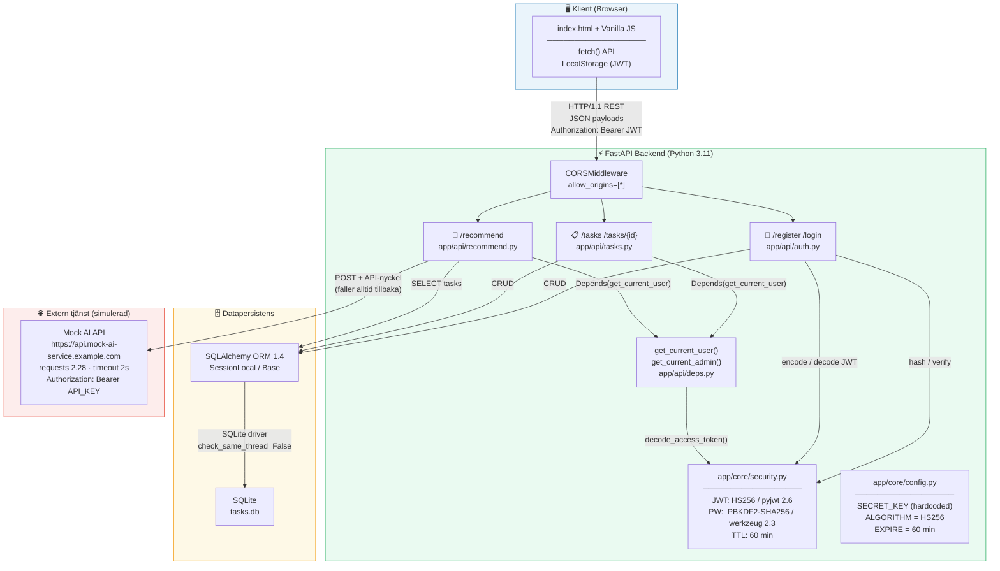
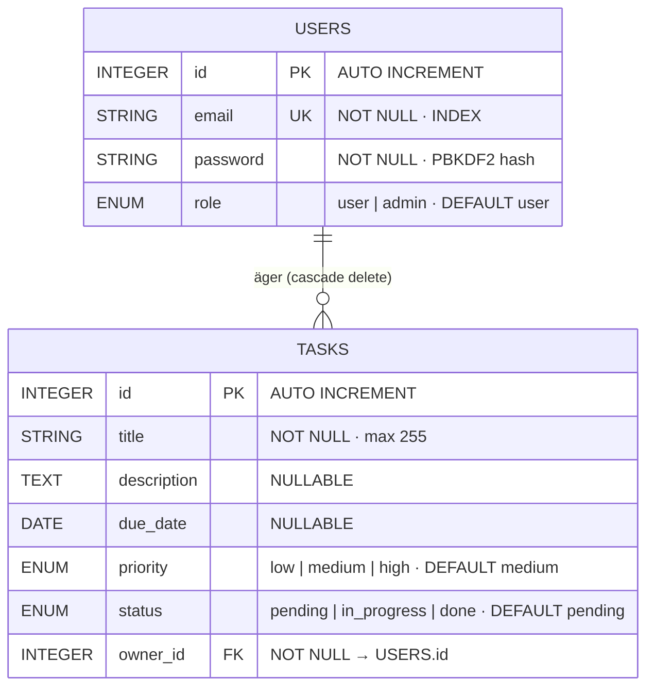
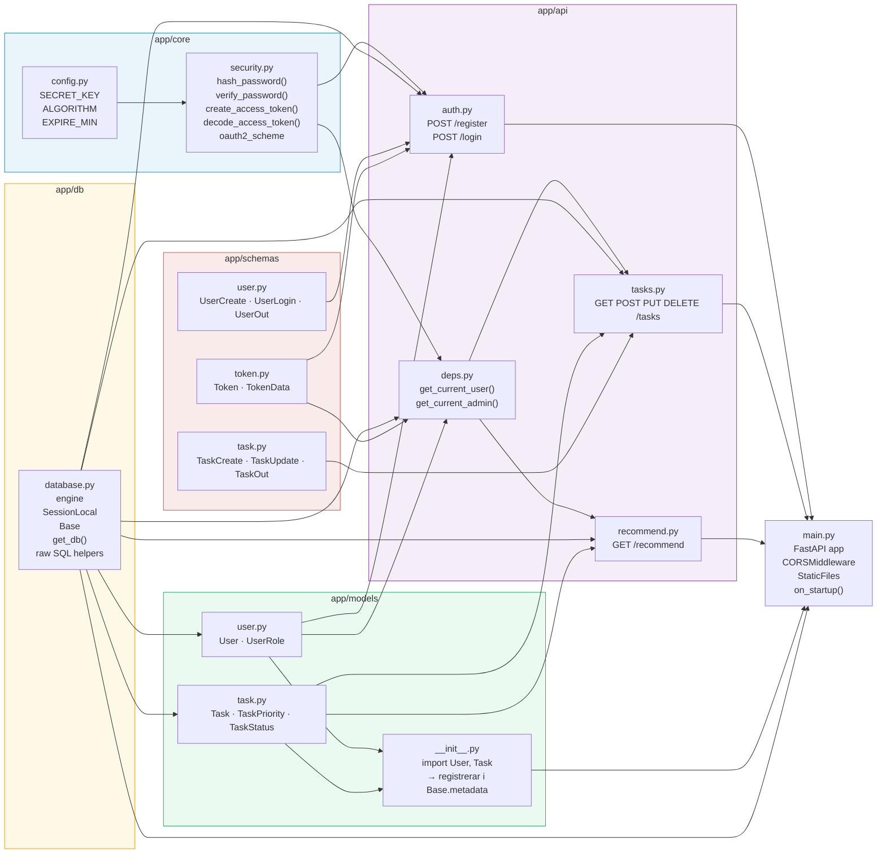
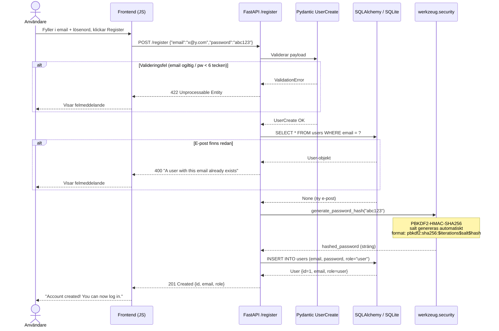
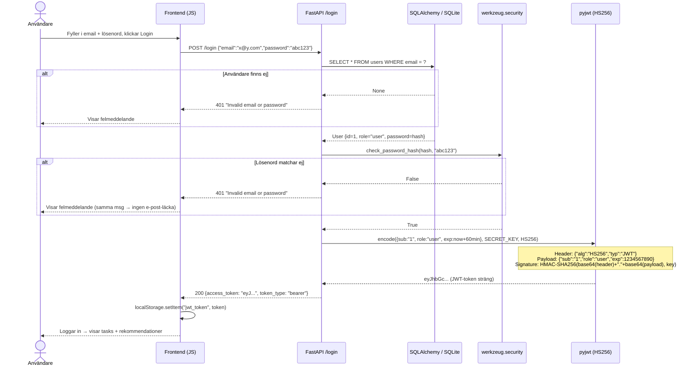
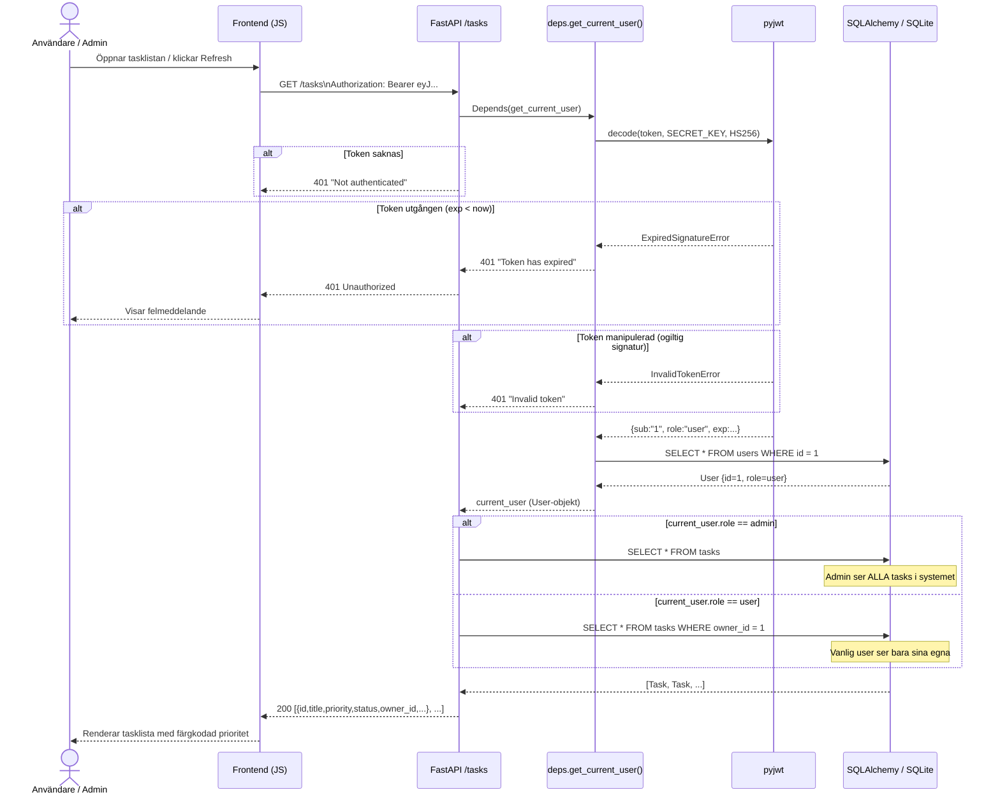
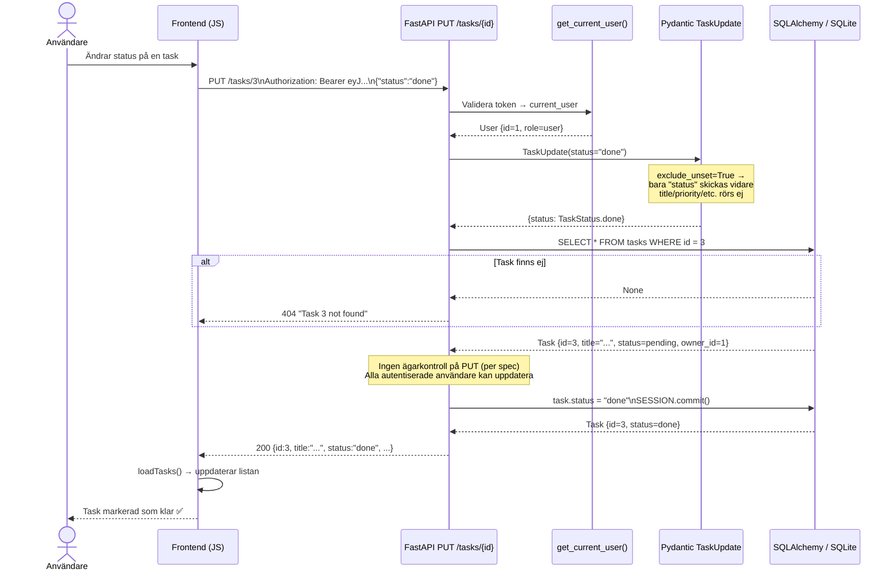
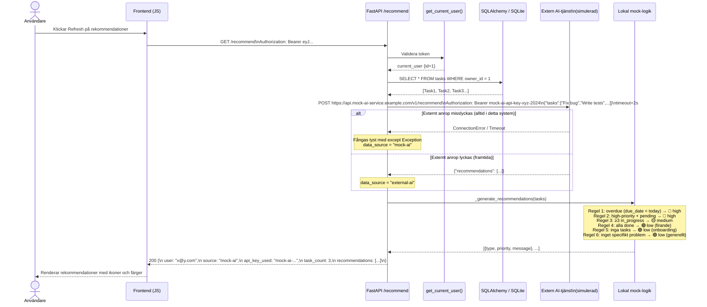
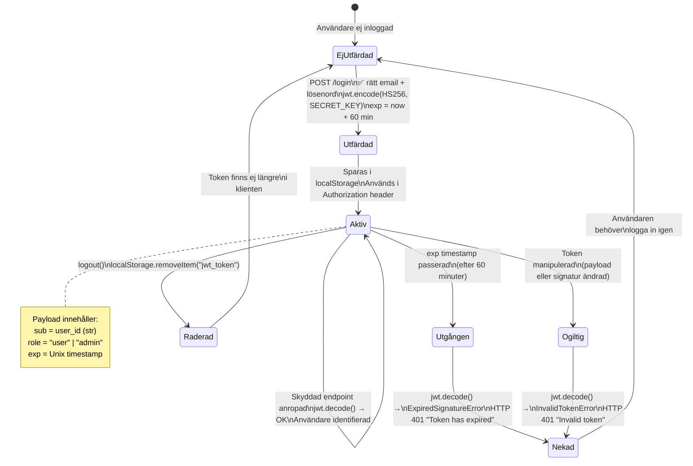
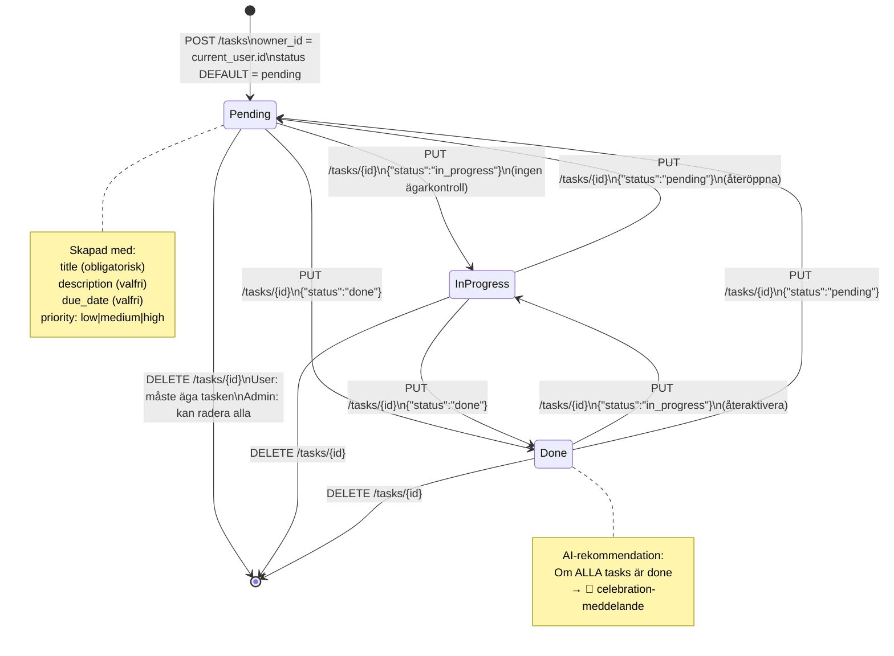

# Task Management System — Arkitektur & Tekniska Detaljer

> Alla figurer är i **Mermaid-syntax** — renderas direkt i VS Code, GitHub, Obsidian m.fl.

---

## Innehållsförteckning

| # | Figur | Typ |
|---|-------|-----|
| 1 | Systemöversikt — komponenter, protokoll, algoritmer | Komponentdiagram |
| 2 | Databasschema — tabeller, kolumner, relationer | ER-diagram |
| 3 | Modulberoenden — intern pakestruktur | UML Komponentdiagram |
| 4 | POST /register — registreringsflöde | Sekvensdiagram |
| 5 | POST /login — autentisering + JWT-utfärdning | Sekvensdiagram |
| 6 | GET /tasks — rollbaserad åtkomst | Sekvensdiagram |
| 7 | PUT /tasks/{id} — uppdateringsflöde | Sekvensdiagram |
| 8 | GET /recommend — AI-anrop med fallback | Sekvensdiagram |
| 9 | JWT-tokens livscykel | Tillståndsdiagram |
| 10 | Tasks livscykel | Tillståndsdiagram |
| 11 | Säkerhetsmodell per lager | Tabell |
| 12 | Storyboard — 5 huvudscenarier | Storyboard |

---

## Figur 1 — Systemöversikt

Visar samtliga systemkomponenter, vilka protokoll de kommunicerar med och vilka
algoritmer/bibliotek som hanterar säkerhet och datapersistens.



---

## Figur 2 — Databasschema (ER-diagram)

Visar de två tabellerna med alla kolumner, datatyper, constraints och relationen däremellan.



---

## Figur 3 — Modulberoenden

Visar hur paketen i `app/` beror på varandra och vad varje paket exporterar.



---

## Figur 4 — POST /register (Sekvensdiagram)



---

## Figur 5 — POST /login + JWT-utfärdning (Sekvensdiagram)



---

## Figur 6 — GET /tasks — Rollbaserad åtkomst (Sekvensdiagram)



---

## Figur 7 — PUT /tasks/{id} — Uppdateringsflöde (Sekvensdiagram)



---

## Figur 8 — GET /recommend — AI-anrop med fallback (Sekvensdiagram)



---

## Figur 9 — JWT-tokens livscykel (Tillståndsdiagram)



---

## Figur 10 — Tasks livscykel (Tillståndsdiagram)



---

## Figur 11 — Säkerhetsmodell per lager

| Lager | Mekanism | Bibliotek / Standard | Detaljer |
|-------|----------|----------------------|----------|
| **Transportlager** | HTTP (dev) / HTTPS (prod) | — | CORS: `allow_origins=["*"]` i dev |
| **Lösenordslagring** | PBKDF2-HMAC-SHA256 | `werkzeug 2.3` | Salt auto-genereras · Aldrig plain text i DB |
| **Autentisering** | JWT Bearer Token | `pyjwt 2.6` · HS256 | Payload: `sub`, `role`, `exp` · TTL 60 min |
| **Tokenöverföring** | Authorization-header | OAuth2 Bearer | `OAuth2PasswordBearer(tokenUrl="/login")` |
| **Tokensignering** | HMAC-SHA256 | `SECRET_KEY` (hardcoded) | Prod: bör vara env-variabel ≥ 256 bitar |
| **Auktorisering** | Rollkontroll (RBAC) | FastAPI `Depends()` | `user`: egna tasks · `admin`: allt |
| **Ägarskapsskydd** | owner_id-kontroll | SQLAlchemy filter | Tillämpas på DELETE, EJ på PUT (per spec) |
| **Input-validering** | Pydantic-modeller | `pydantic` (via FastAPI) | Typkontroll · min/max-längder · EmailStr |
| **SQL-injektion** | Parametriserade queries | SQLAlchemy ORM + `text()` | `:param`-syntax i alla raw SQL-queries |
| **Felmeddelanden** | Generiska auth-fel | FastAPI `HTTPException` | "Invalid email or password" (läcker ej om e-post finns) |

---

## Figur 12 — Storyboard: 5 huvudscenarier

```
╔══════════════════════════════════════════════════════════════════════════════╗
║                    STORYBOARD — TASK MANAGEMENT SYSTEM                     ║
╠══════════════════════════════════════════════════════════════════════════════╣
║                                                                              ║
║  SCENARIO 1: Ny användare registrerar sig och loggar in                     ║
║  ─────────────────────────────────────────────────────                      ║
║                                                                              ║
║  [Browser]          [POST /register]        [SQLite]                        ║
║     │                     │                    │                            ║
║     │  Öppnar /frontend   │                    │                            ║
║     │◄────────────────────│  index.html        │                            ║
║     │                     │                    │                            ║
║     │  email + password   │                    │                            ║
║     │────────────────────►│  Validerar Pydantic│                            ║
║     │                     │  hash_password()   │                            ║
║     │                     │───────────────────►│  INSERT user               ║
║     │  201 {id,email,role}│◄───────────────────│                            ║
║     │◄────────────────────│                    │                            ║
║     │  POST /login        │                    │                            ║
║     │────────────────────►│  verify_password() │                            ║
║     │                     │  jwt.encode()      │                            ║
║     │  200 {access_token} │                    │                            ║
║     │◄────────────────────│                    │                            ║
║     │  localStorage ✓     │                    │                            ║
║                                                                              ║
╠══════════════════════════════════════════════════════════════════════════════╣
║                                                                              ║
║  SCENARIO 2: Användaren skapar och hanterar tasks                           ║
║  ─────────────────────────────────────────────────                          ║
║                                                                              ║
║  [Browser]          [POST /tasks]           [SQLite]                        ║
║     │                     │                    │                            ║
║     │  Fyller i formulär  │                    │                            ║
║     │  title="Fix bug"    │                    │                            ║
║     │  priority=high      │                    │                            ║
║     │────────────────────►│  Bearer JWT        │                            ║
║     │                     │  decode_token()    │                            ║
║     │                     │  owner_id=1 (auto) │                            ║
║     │                     │───────────────────►│  INSERT task               ║
║     │  201 {id,title,...} │◄───────────────────│                            ║
║     │◄────────────────────│                    │                            ║
║     │                     │                    │                            ║
║     │  PUT /tasks/1       │                    │                            ║
║     │  {"status":"done"}  │                    │                            ║
║     │────────────────────►│  exclude_unset=True│                            ║
║     │                     │───────────────────►│  UPDATE tasks SET          ║
║     │  200 {status:"done"}│◄───────────────────│  status="done"             ║
║     │◄────────────────────│                    │                            ║
║                                                                              ║
╠══════════════════════════════════════════════════════════════════════════════╣
║                                                                              ║
║  SCENARIO 3: Admin ser alla användares tasks                                ║
║  ────────────────────────────────────────────                               ║
║                                                                              ║
║  [Admin Browser]    [GET /tasks]            [SQLite]                        ║
║     │                     │                    │                            ║
║     │  Bearer JWT (admin) │                    │                            ║
║     │────────────────────►│  decode → role=admin                           ║
║     │                     │───────────────────►│  SELECT * FROM tasks       ║
║     │                     │                    │  (ALLA tasks, ej filtrerat)║
║     │                     │◄───────────────────│  [task1, task2, task3...]  ║
║     │  200 [alla tasks]   │                    │                            ║
║     │◄────────────────────│                    │                            ║
║                                                                              ║
║  [User Browser]     [GET /tasks]            [SQLite]                        ║
║     │                     │                    │                            ║
║     │  Bearer JWT (user)  │                    │                            ║
║     │────────────────────►│  decode → role=user│                            ║
║     │                     │───────────────────►│  SELECT * FROM tasks       ║
║     │                     │                    │  WHERE owner_id = 1        ║
║     │  200 [egna tasks]   │◄───────────────────│  (bara egna)               ║
║     │◄────────────────────│                    │                            ║
║                                                                              ║
╠══════════════════════════════════════════════════════════════════════════════╣
║                                                                              ║
║  SCENARIO 4: AI-rekommendationer med extern API-fallback                    ║
║  ───────────────────────────────────────────────────────                    ║
║                                                                              ║
║  [Browser]    [GET /recommend]   [Extern AI]   [Mock-logik]                 ║
║     │               │                │              │                       ║
║     │  Bearer JWT   │                │              │                       ║
║     │──────────────►│  hämtar tasks  │              │                       ║
║     │               │                │              │                       ║
║     │               │──────────────►│  POST + API-nyckel                   ║
║     │               │                │  timeout=2s  │                       ║
║     │               │◄──────────────│  ❌ ConnectionError                  ║
║     │               │  (fångas tyst) │              │                       ║
║     │               │──────────────────────────────►│                       ║
║     │               │                │  Analyserar: │                       ║
║     │               │                │  overdue?    │                       ║
║     │               │                │  high+pending│                       ║
║     │               │                │  ≥3 in_prog? │                       ║
║     │               │◄──────────────────────────────│                       ║
║     │  200 {source:"mock-ai",        │              │                       ║
║     │   recommendations:[...]}       │              │                       ║
║     │◄──────────────│                │              │                       ║
║                                                                              ║
╠══════════════════════════════════════════════════════════════════════════════╣
║                                                                              ║
║  SCENARIO 5: Utgången token → 401 → omloggning                             ║
║  ──────────────────────────────────────────────                             ║
║                                                                              ║
║  [Browser]          [FastAPI]             [pyjwt]                           ║
║     │                     │                    │                            ║
║     │  GET /tasks         │                    │                            ║
║     │  Bearer <gammal JWT>│                    │                            ║
║     │────────────────────►│  decode_access_token()                         ║
║     │                     │───────────────────►│  exp < now?                ║
║     │                     │◄───────────────────│  ✅ Ja → ExpiredSignatureError
║     │                     │  raise HTTP 401    │                            ║
║     │  401 "Token has     │                    │                            ║
║     │   expired"          │                    │                            ║
║     │◄────────────────────│                    │                            ║
║     │  Visar felmeddelande│                    │                            ║
║     │  Användaren loggar in igen               │                            ║
║     │  → nytt JWT utfärdas (TTL reset)         │                            ║
║                                                                              ║
╚══════════════════════════════════════════════════════════════════════════════╝
```

---

## Teknisk referens — snabbguide

| Konstant / Nyckel | Värde | Plats |
|---|---|---|
| `SECRET_KEY` | `"supersecret-taskmanager-key-2024"` | `app/core/config.py` |
| `ALGORITHM` | `HS256` (HMAC-SHA256) | `app/core/config.py` |
| `ACCESS_TOKEN_EXPIRE_MINUTES` | `60` | `app/core/config.py` |
| `EXTERNAL_AI_API_KEY` | `"mock-ai-api-key-xyz-2024"` | `app/api/recommend.py` |
| `SQLALCHEMY_DATABASE_URL` | `"sqlite:///./tasks.db"` | `app/db/database.py` |
| DB-fil | `tasks.db` (skapas automatiskt) | projektrot |
| Frontend | `http://127.0.0.1:8000/frontend` | `app/static/index.html` |
| API-docs | `http://127.0.0.1:8000/docs` | FastAPI Swagger UI |
